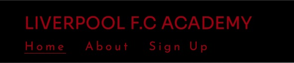

# 1. Purpose of the project
Liverpool F.C Academy website is made for parents that want to sign up their child to the Academy of Liverpool. The parents can sign up their child for a new beginning of their life in this wonderful Football club.

Users of this website will be able to find information about the training facility, the club stadium, trophies, fans, our song, and a sign up form. This site is targeted towards parents of children who wants to play football at Liverpool F.c  

for the live site click
<a src=https://mustafasahinci.github.io/Code-Institute-first-project/index.html target="_blank" rel="noopener" > here</a>

# 2. user stories
- as visiting user, I would like to find my way through the website with an easy nav bar
- As visiting user, I would like to get information about the football club and Academy.
- As visiting user, I would like to get information about how to contact the club.
- As visiting user, I would like to know the place of the training facility
- As visiting user, I would like to easily sign-up my child
- As visiting user, I would like to get feedback when I register my child
- As visiting user, I would like to find them easily on social media

# 3. Features
## Navigation bar
- The navigation bar is featured on all four pages, the full responsive navigation bar includes links to the Logo, Home page, About, and Sign Up page and is identical on each page to allow for easy navigation.
- The navigation bar will allow the user to easily navigate from page to page across all devices without having to revert back to the previous page via the ‘back’ button.
- The logo and Home links have the same anchor to the home page, and the about and sign-up links have an anchor to their pages
- The page that the user is currently on has an underline, and when hovered the link gets an underline. 
- The navigation bar is also fixed on the website so it is always easily accessible
 
- On a smaller screen the menu on the right side is positioned under the logo

## Home page
- Hero image
  - The hero image is a picture that is the same on every page
  - On the Home and About pages the overlaying text says: Sign up your child! whit a button Join now! that turns white when you hover over it.
  - On the Sign-up page the overlaying text says: Sing up your child here with 3 down-arrows

- Home page
  - the home page has an background-image, this image is same on all the pages
  - The home page includes two pictures of the two greatest players of Liverpool from this time. So the parents can look and fantasize about their child becoming as good as these players.
  - The header is to convince the parents
  - The 3 inline-block's are also for convincing the parents, and showing what this club has to offer

  

 